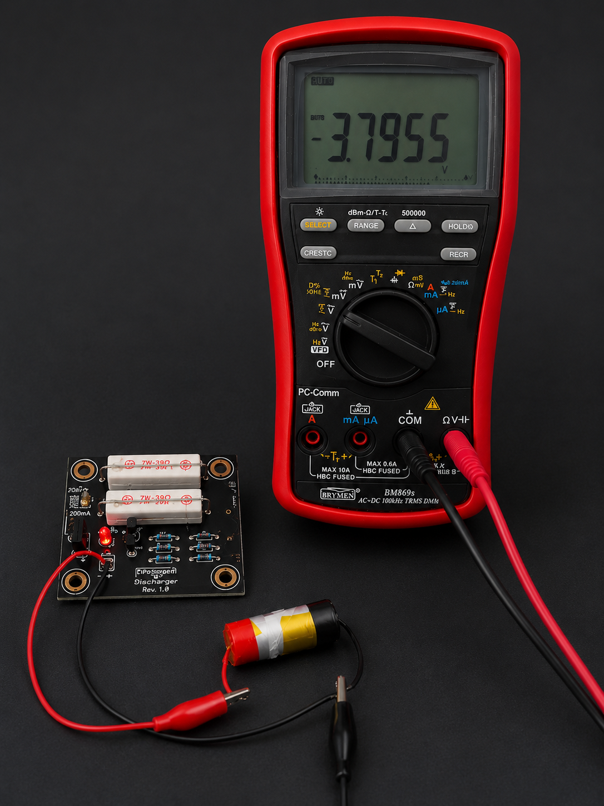

# LiPo_Storage_Discharger
A simple analog LiPo storage discharger designed to automatically discharge a 1S LiPo cell to a safe storage voltage of approximately 3.80V.

This project was created after discovering that many battery analyzers and capacity testers can only leave a cell either fully charged or fully discharged. For long-term storage, neither condition is ideal. This circuit provides a simple and inexpensive way to automatically discharge a fully charged cell to the recommended storage voltage.

---

## Features

* Automatic storage discharge for 1S LiPo batteries
* Target voltage approximately 3.80V
* Selectable discharge current:

  * 100mA
  * 200mA
* Fully analog design
* No microcontroller required
* Very low standby current after cutoff
* LED discharge indicator
* Through-hole components only
* Easy and cheap to build and repair

---

## Circuit Principals

The circuit uses a **TL431 precision reference** to monitor the battery voltage through a resistor divider.

When the battery voltage is above the storage threshold:

1. The TL431 conducts.
2. The PNP transistor (BC557) turns on.
3. The MOSFET gate is driven high.
4. The IRLZ44N MOSFET switches on.
5. The discharge resistors are connected to the battery.

As the battery voltage decreases and reaches approximately **3.80V**, the TL431 turns off, removing gate drive from the MOSFET and disconnecting the load.

A feedback resistor provides hysteresis, preventing oscillation around the switching point.

---

## Measured Behavior and Known Limitations

The first prototype was tested with a real 1S LiPo cell and a long-term voltage-logging setup.

The circuit successfully discharged the battery to approximately **3.82V**, which is well within the recommended LiPo storage voltage range of **3.80V to 3.85V**. While the design achieves its intended purpose, testing revealed several limitations inherent to the current TL431-based implementation.

### Soft Switching Behavior

Unlike a dedicated comparator, the combination of the TL431 reference and BC557 transistor does not produce a perfectly sharp switching transition.

As the battery voltage approaches the cutoff threshold, the circuit enters a transition region where:

* The TL431 is partially conducting.
* The BC557 begins to lose drive.
* The MOSFET is no longer fully enhanced.

This results in a gradual transition rather than a hard on/off switching point.

### Cutoff Accuracy

The measured storage voltage was approximately **3.82V**, but the actual cutoff voltage can vary between units due to:

* Resistor tolerances.
* TL431 reference tolerance.
* BC557 VBE variation.
* Temperature effects.

A variation of several tens of millivolts should be expected.

### Load Dependency

The final battery voltage is influenced by the selected discharge current.

Changing the discharge resistor values may slightly alter the switching behavior and the cell's final resting voltage.

### Temperature Dependency

The TL431 reference and transistor base-emitter voltage both vary with temperature.

For normal indoor use, this effect is relatively small, but the cutoff voltage may shift under extreme hot or cold conditions.

### Not a Precision Battery Management System

This project is intentionally designed to be a simple, inexpensive storage discharger.

It should not be considered a precision battery management system or battery protection circuit.

Its purpose is to automatically bring a LiPo cell into the recommended storage voltage range with minimal component count and cost.

### Not a Charger

This circuit only discharges a battery to storage voltage and provides no charging functionality.

### Future Improvements

A future Version 2 may replace the TL431/BC557 combination with a dedicated low-power comparator featuring:

* Internal voltage reference.
* Adjustable hysteresis.
* Sharper switching behavior.
* Improved cutoff accuracy.
* Reduced dependency on component tolerances.

The current Version 1 remains fully functional and suitable for practical LiPo storage preparation.

---

## Specifications

| Parameter         | Value           |
| ----------------- | --------------- |
| Battery type      | 1S LiPo         |
| Storage voltage   | ~3.80V          |
| Discharge current | ~100mA / ~200mA |
| Reference         | TL431A          |
| Switching device  | IRLZ44N         |
| Standby current   | <100µA          |
| Construction      | Through-hole    |

---

## Current Selection

The discharge current is selected using jumper **H1**.

| Jumper Position | Current |
| --------------- | ------- |
| Open            | ~100mA  |
| Closed          | ~200mA  |

The discharge resistors are oversized 39Ω / 7W resistors to keep temperatures low during operation.

---

## Advantages

### Simple

No firmware, software, menus or configuration required.

### Reliable

The circuit consists of only a handful of well-known components.

### Low Power

After reaching the storage voltage, the discharge load is disconnected, and only a small quiescent current remains.

### Easy to Repair

All components are through-hole and readily available.

### Inexpensive

No specialized ICs or battery-management controllers are required.

---

## Typical Use Case

1. Connect a LiPo cell above storage voltage after test or usage.
2. The circuit automatically discharges the cell.
3. At approximately 3.80V, the load disconnects and the discharge stops.
4. The battery is ready for long-term storage.

---

## Safety Notice

This project is intended for experienced electronics hobbyists.

Always:

* Use undamaged LiPo cells.
* Never leave batteries unattended during testing.
* Verify cutoff voltage before use.
* Monitor the first few discharge cycles.
* Use suitable fire-safe storage procedures for lithium batteries.

---

## License

Open-source hardware project.

Build it, modify it, improve it, and share your results.

